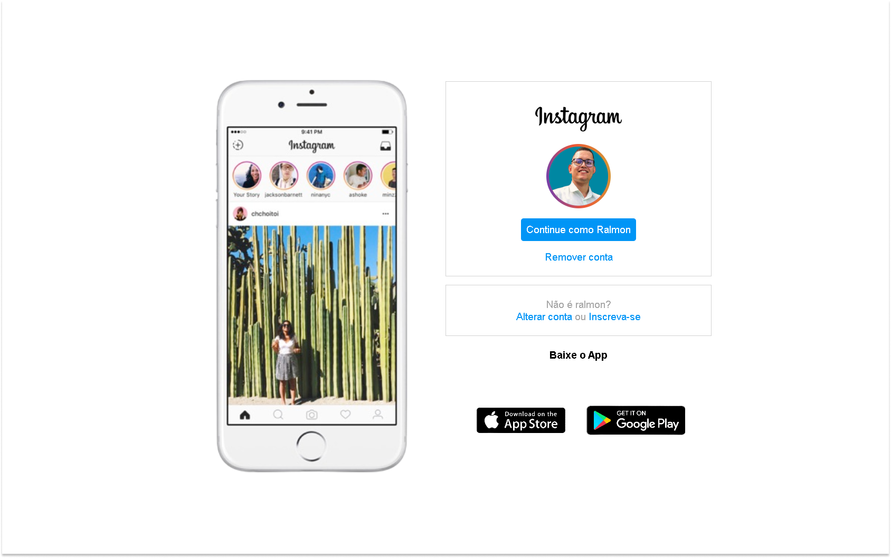

" />

## 👨🏽‍💻 Projeto
É um projeto Web responsivo onde recriei a pagina inicial do instagram.

## 🚀 Tecnologias
Esse projeto foi desenvolvido durante o curso HTML Web Developer da DIO com as seguintes tecnologias.

- HTML
- CSS
- GIT e Github
